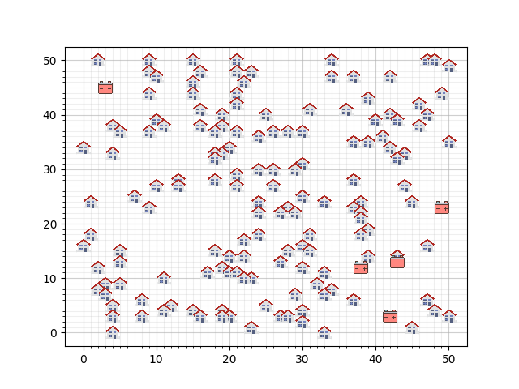
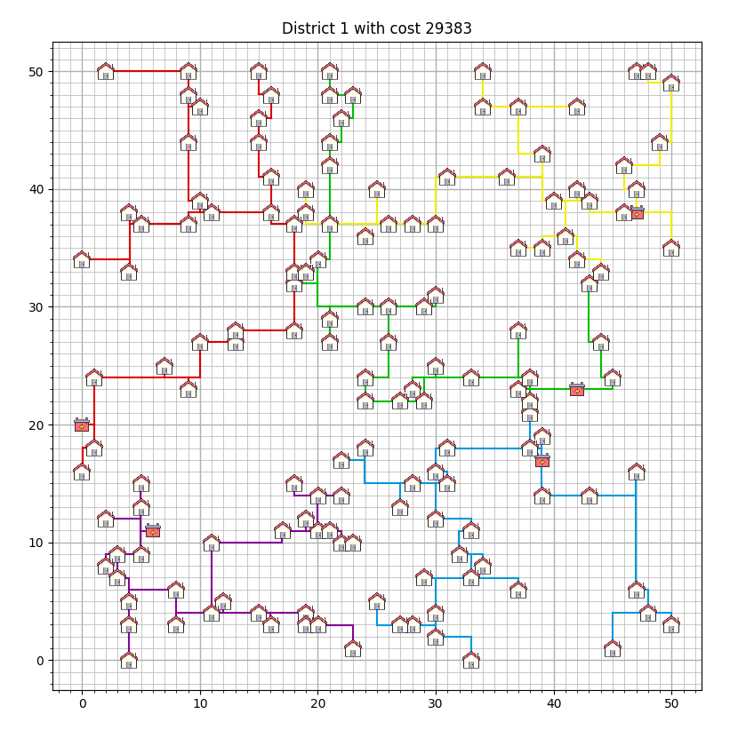

# Smart Grid

Welkom bij ons project voor het vak 'Algoritmen en Heuristieken' voor de minor programmeren aan de Universiteit van Amsterdam. Hier proberen we een onmogelijke case op te lossen. Wij hebben voor de case 'Smart Grid' gekozen.

## Case Uitleg

In de case 'Smart Grid' wordt een grid gegeven met huizen die allemaal energie kunnen leveren. Op de grid staan ook batterijen die deze energie moeten opslaan. Deze batterijen hebben wel een maximum capaciteit die niet overschreden mag worden. Om de energie van een huis naar een batterij te brengen moeten kabels worden gelegd. Deze kabels kosten geld en dus is het belangrijk om dit zo efficient mogelijk te doen. Aan ons de taak om de kosten zo laag mogelijk te houden. 

Hierbij moeten we ons aan bepaalde vereisten houden:
- Batterijen mogen niet aan elkaar verbonden zijn. Ook niet via een huis.
- Een huis mag niet aan meerdere batterijen verbonden zijn.
- Er mogen meerdere kabels over dezelfde gridsegmenten lopen.

Dit probleem heeft verschillende gradaties in moeilijkheid:
1. Alle huizen moeten een unieke kabel naar een batterij hebben.
2. Huizen mogen kabels delen.
3. Batterijen mogen verplaatst worden.
4. Je mag zelf batterijen kiezen uit een selectie en deze overal plaatsen waar je wil.

Bij elke gradatie is het doel om de kosten zo laag mogelijk te houden. De kosten kunnen berekend worden door voor elke kabel 9 te rekenen en voor elke 'normale' batterij (de batterijen van gradatie 1 t/m 3) 5000 te rekenen.

Bij de laatste gradatie kan uit de volgende batterijtypes worden gekozen met elk hun eigen prijs en capaciteit.

| **Batterijtype** | **Capaciteit** | **Prijs** |
|------------------|----------------|-----------|
| PowerStar        | 450            | 900       |
| Imerse-II        | 900            | 1350      |
| Imerse-III       | 1800           | 1800      |

Om ons algoritme te testen, zijn er drie dummy-woonwijken opgesteld. Deze zijn gegeven in csv-bestanden. Deze wijken zien er als volgt uit:



## Aan de slag

### Vereisten 

Dit project is volledig geprogrammeerd in Python. De vereiste modules kunnen geïnstalleerd worden m.b.v. het volgende command.

```bash
python3 -m pip install -r requirements.txt
```

> NOTE:
> Dit command kan per persoon verschillen afhankelijk van de installatie van python.

### Hoe te gebruiken

Het programma kan worden gerund door de main.py file te runnen. Hiervoor moeten wel nog enkele command-line arguments worden toegevoegd voordat het programma kan werken. Zo moet het eerste argument het district zijn en het tweede argument welk algoritme. Een algemeen voorbeeld is hieronder gegeven:

```bash
python3 main.py [DISTRICT] [ALGORITHM]
```

Voor `DISTRICT` kan je 1 t/m 3 invullen en voor `ALGORITHM` kan je kiezen uit een van de volgende algoritmes([hier](#algoritmes) meer info):
- baseline
- greedy
- sd_hill_climber
- baseline_shared
- greedy_shared
- hill_climber_shared
- sd_hill_climber_shared
- simulated_annealing
- plant_propagation
- hill_climber_battery
- clustering

Standaard wordt het resultaat opgeslagen in een JSON bestand te vinden op `/results/output.json`. Daarnaast wordt het ook gevisualiseerd in een matplotlib venster. Deze output methodes kunnen worden uitgeschakeld door de desbetreffende regel te commenten in regels 51 t/m 55 in main.py.

De visualisatie zou er ongeveer zo uit moeten komen te zien:



Om de eerdere resultaten die opgeslagen zijn een JSON bestand te visualiseren kan het volgende commando gebruikt worden:

```bash
python3 visualize_json.py [FILEPATH]
```

### Structuur

De hierop volgende lijst beschrijft de belangrijkste mappen en files in het project, en waar je ze kan vinden:

- /code: bevat alle code van dit project
    - /code/algorithms: bevat de code voor algoritmes
      - /code/algorithms/own_cables: bevat alle algoritmes voor het unieke kabel probleem
      - /code/algorithms/shared_cables: bevat alle algoritmes voor het gedeelde kabel probleem
      - /code/algorithms/battery_move: bevat alle algoritmes voor het gedeelde kabel en batterij bewegen probleem
    - /code/classes: bevat de benodigde classes voor deze case
    - /code/visualisation: bevat de code voor de visualisatie
    - /code/export: bevat de code voor het exporteren naar een JSON bestand
    - /code/helper_functions: bevat functies die in meerdere algoritmes worden gebruikt
- /data: bevat de verschillende databestanden die nodig zijn om de grid in te laden
- /docs: bevat de verslagen voor dit project
- /results: bevat de resultaten van eerdere runs geordend

## Algoritmes

Hier bespreken we de algoritmes die we hebben.

### Baseline

[Hier](docs/baseline.md) wordt meer informatie gegeven over de baseline met unieke kabels. Dit algoritme kan gerund worden door 'baseline' in te vullen bij `ALGORITHM`.

WAT INVULLEN VOOR BASELINE SHARED

### Greedy

WAT INVULLEN VOOR GREEDY

WAT INVULLEN VOOR GREEDY SHARED

### Hill Climber

WAT INVULLEN VOOR HILL CLIMBER

Dit algoritme maakt 1 willekeurige verandering op een random grid, en kijkt dan vervolgens of dit een betere oplossing is. Het kijkt een N aantal keer of er een verbetering is gevonden en als dit niet zo is wordt het algoritme gestopt. Als er wel een verbetering wordt gevonden, kijkt het algoritme opnieuw N keer met een willekeurige verandering of er een betere oplossing gevonden kan worden.

Dit algoritme kan ook worden gecombineerd met een greedy algoritme. Dan is het initiele grid niet een random grid, maar een oplossing uit het greedy algoritme, waardoor je in het algemeen begint met een betere oplossing die dan vervolgens wordt berekend met het algoritme.

### Steepest Descent Hill Climber

WAT INVULLEN VOOR SD HILL CLIMBER

WAT INVULLEN VOOR SD HILL CLIMBER SHARED

### Simulated Annealing

WAT INVULLEN VOOR SIMULATED ANNEALING

### Plant Propagation Algorithm

WAT INVULLEN VOOR PLANT PROPAGATION ALGORITHM

### Hill Climber Moveable Battery

WAT INVULLEN VOOR HILL CLIMBER BATTERY

### Clustering

WAT INVULLEN VOOR CLUSTERING


## Experimenteren

Documentatie van onze experimenten met de verschillende algoritmes is [hier](docs/experiment.md) te vinden.

## Auteurs

- Xander Broos
- Miguel Siewe
- Sander Britton

## Credits

[Home Page](https://icons8.com/icon/103183/home-page) icon by [Icons8](https://icons8.com)

[Normal battery](https://icons8.com/icon/Vw6xKWsHOBPo/battery) icon by [Icons8](https://icons8.com)

[PowerStar battery](https://icons8.com/icon/Sy5Roz5qTmgs/battery) icon by [Icons8](https://icons8.com)

[Imerse-II battery](https://icons8.com/icon/nhowbLkfABQB/battery) icon by [Icons8](https://icons8.com)

[Imerse-III battery](https://icons8.com/icon/09kDf3bDCwgu/battery) icon by [Icons8](https://icons8.com)
