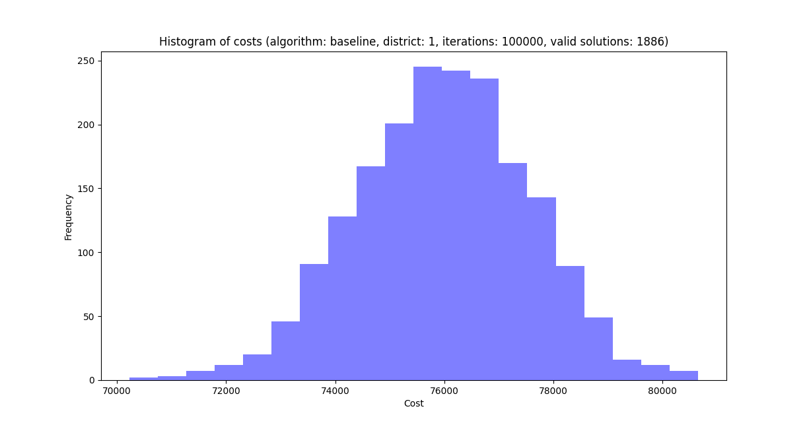
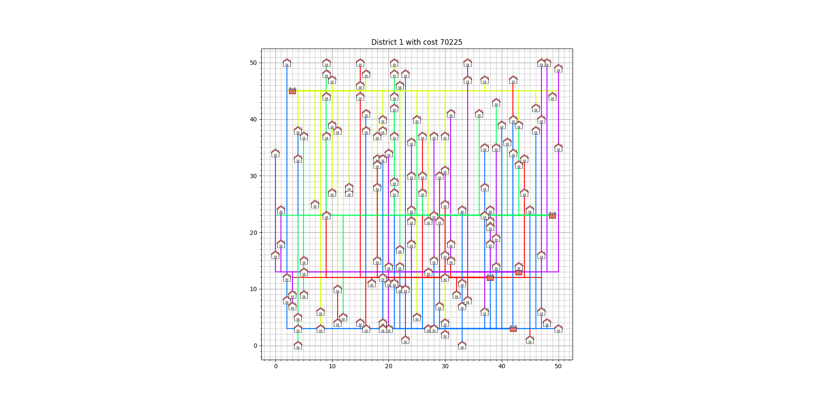
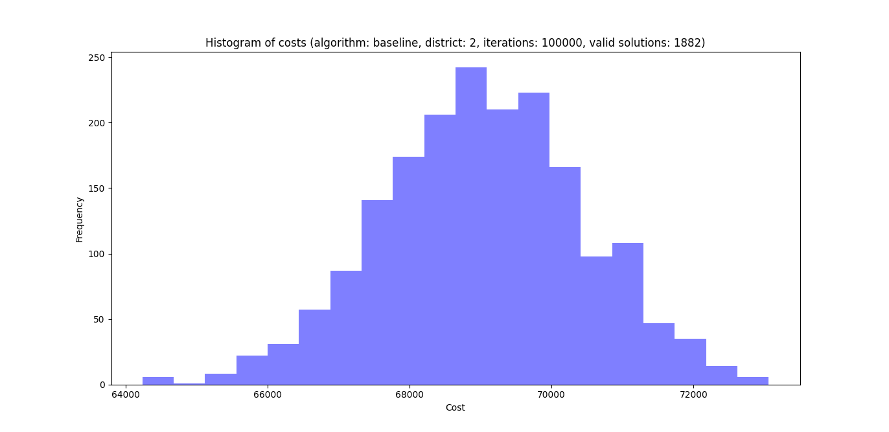
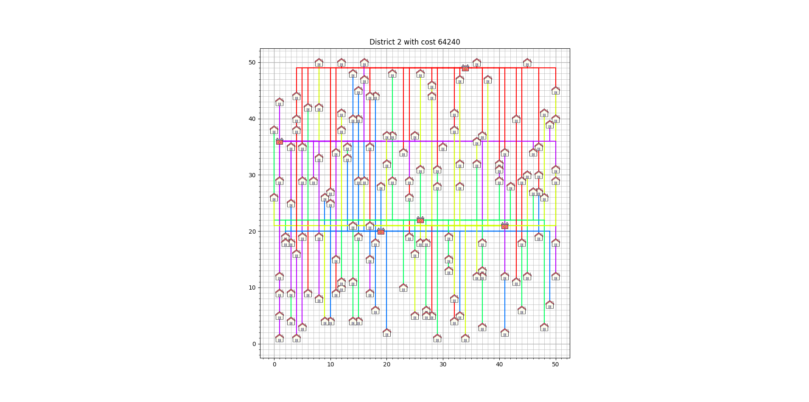
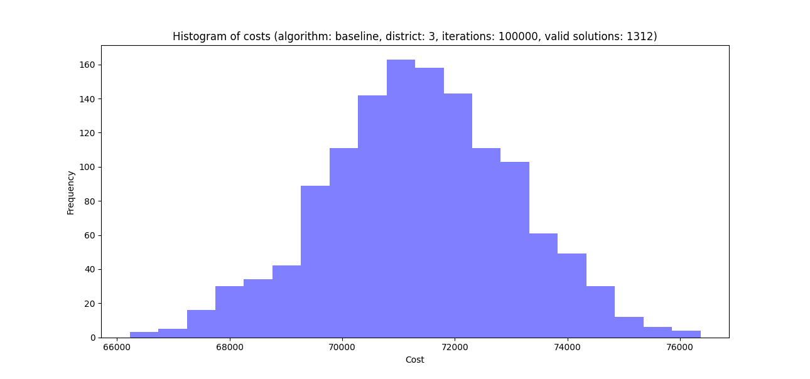
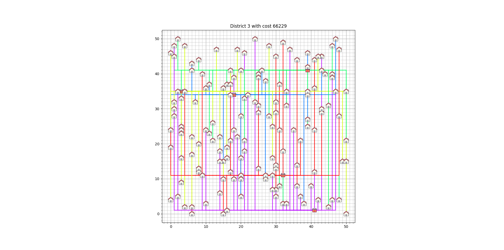

# Baseline

In dit document gaan we een baseline zetten voor de oplossing van onze case, Smart Grid. Hierin gaan we eerst de methode uitleggen en dan de resultaten geven en analyseren.

## Methode

Om een baseline te zetten voor onze algoritmes, hebben we een random algoritme gemaakt. Deze maakt random connecties tussen huizen en batterijen. Hierbij houdt het algoritme alleen rekening met of een batterij wel de connectie met het huis aankan. Als dit niet zo is, wordt de connectie ook niet gemaakt. Als een huis aan geen enkele batterij kan worden gekoppeld, wordt de poging gestopt. Van elke geldige oplossing wordt de cost berekend en opgeslagen. Deze worden geplot in een histogram. De beste oplossing wordt gevisualiseerd in een grid.

## Resultaten

Hier worden de resultaten gegeven voor de baseline van de drie districts.

### District 1

### District 2

### District 3

### Analyse

Alle bovenstaande histogrammen lijken redelijk op een normaalverdeling. Wij denken dat dit wél een uniforme steekproef is, want alleen de geldige oplossingen worden gebruikt, en omdat we alleen (zo goed mogelijk) random verbindingen maken, zit er nergens een bias in onze methode. De enige bias die wij kunnen bedenken, zou zijn dat computers niet écht random getallen kunnen creëeren, maar dat is verwaarloosbaar.

Voor district 1, is de gemiddelde cost van een random oplossing ongeveer 76000 en is de minimum oplossing 70225
Voor district 1, is de gemiddelde cost van een random oplossing ongeveer 68600 en is de minimum oplossing 64240
Voor district 1, is de gemiddelde cost van een random oplossing ongeveer 71000 en is de minimum oplossing 66229

## Conclusie

Op basis van de baseline, weten we dat ieder algoritme die een hogere cost heeft dan de gemiddelde random oplossing niet werkt. Zelfs oplossingen die in de buurt zitten van het minimum werken zo goed als je zou verwachten. Als we dit soort resultaten vinden, weten we dus dat of een algoritme niet naar behoren werkt, of dat het algoritme niet nuttig is voor deze casus.