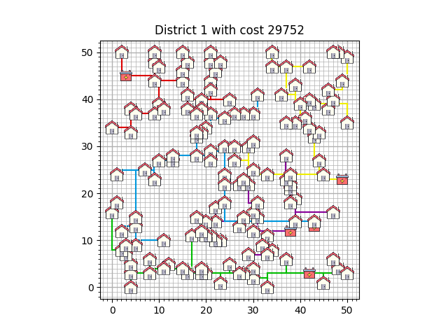
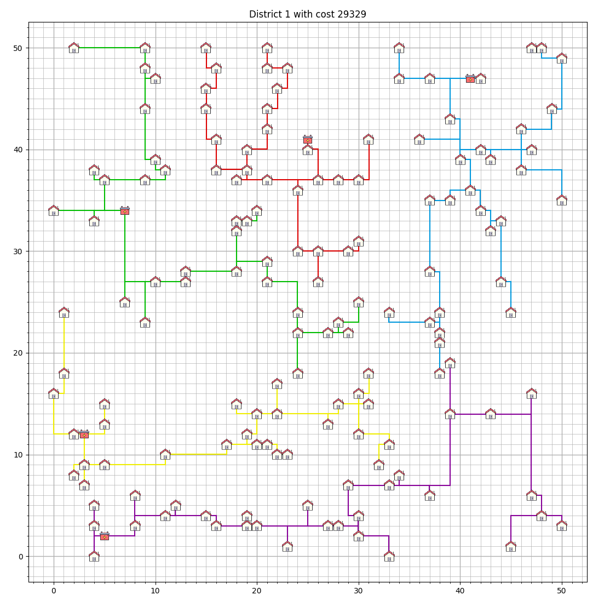

# Experimenteren

In dit document bespreken we hoe we hebben geëxperimenteerd en resultaten hebben verzameld. Ten eerste bespreken we de methode die we hebben gebruikt. Vervolgens bespreken we een theoretisch optimum die kan helpen met het beoordelen van resultaten. Daarna gaan we de resultaten en experimenten voor de case met unieke kabels, gedeelde kabels en dan met het verplaatsen van batterijen bespreken.

## Methode - moet worden gecheckt

Wij hebben voor de tests eigenlijk alle algoritmes een aantal keer gerund. Deze algoritmes hebben we allemaal op hetzelfde district gerund, namelijk district 1, zodat we de resultaten goed met elkaar konden vergelijken. Voor de meeste algoritmes waren er niet veel parameters te veranderen, behalve voor de plant propagation en de simulated annealing. Hieronder (misschien linken naar kopjes) wordt uitgelegd hoe we zijn gekomen op de door ons gekozen parameter waardes voor [plant propagation](#plant-propagation-algorithm) en [simulated annealing](#simulated-annealing-algorithm).

We hebben de algoritmes parallel gerund, zodat de we meer oplossingen kregen in dezelfde tijd. Hiervoor hebben we in de runtime gecompenseerd, door de runtime te vermenigvuldigen met het aantal dat het algoritme parallel is gerund. De beste resultaten voor elk algoritme hebben we opgeslagen in een tabel. Dit hebben we gedaan voor de drie cases, die hieronder worden uitgelegd.

Onze code was zo geschreven, zodat het lastig was om al onze algoritmes te runnen in een vaste tijd. Hierdoor hebben we niet alle algoritmes even lang laten runnen. Voor de rest was het niet erg interessant om de runtimes hetzelfde te houden, omdat hier alsnog verschul had kunnen komen tussen verschillend runtimes van de [PC's](#Verschillen-in-runtime). Om wel redelijke resultaten te krijgen, hebben we de parameters zo gekozen, zodat algoritmes genoeg tijd kregen om tot een goede oplossing te komen, maar zodat ze niet te lang runde waardoor ze dagen tot weken zouden gaan runnen.

### Verschillen in runtime

Voor het runnen van de code zijn verschillende laptops gebruikt met verschillende specificaties. Omdat dit grote gevolgen kan hebben voor de runtime van een programma. Om deze reden zetten we bij de resultaten neer welke PC het algoritme heeft gerund om bij een bepaalde tijd uit te komen, en wordt hier een lijst met de specificaties van de PCs neergezet:
<pre>
- PC 1   CPU: i5-12400F             RAM: 32GB, 3400MHz DDR4
- PC 2   CPU: i7-9750H              RAM: 16GB, 2667MHz DDR4
- PC 3   CPU: i7-8750-H             RAM: 16GB, 2667MHz DDR4
- PC 4   CPU: AMD Ryzen 7 4700U     RAM: 16GB, 3200MHz DDR4
</pre>

## Theoretisch optimum

Het is voor deze case lastig te bepalen wanneer het absolute optimum is gevonden. Daarom is het interessant om te kijken naar een theoretisch optimum. Dit geeft een idee van hoe veel kosten je minimaal moet maken en dus hoe goed een oplossing is.

Voor het theoretisch optimum doen we de volgende aannames:
- Er zijn altijd 5 batterijen en 150 huizen.
- Elk huis heeft minstens 1 kabel nodig om de connectie tussen de batterij en het huis te verwezenlijken.

Deze aannames is ver van de daadwerkelijke situatie voor de unieke kabels case. Hierbij zouden namelijk alle huizen op een afstand van 1 van een batterij moeten zitten, wat zou betekenen dat er heel veel huizen op dezelfde plek zouden moeten zitten. 

Voor de gedeelde kabels case is dit echter wel mogelijk. Hierbij is het namelijk mogelijk dat alle huizen op een sliert liggen, met 1 afstand tussen elk huis en 1 afstand naar een batterij.

Het theoretische optimum kan volgens de volgende formule worden berekend.

$$theoretisch\ optimum = kosten_{per\ batterij} \cdot n_{batterijen} + kosten_{per\ kabel} \cdot n_{kabels}$$

$$theoretisch\ optimum = 5000 \cdot 5 + 9 \cdot 150 = 26350$$

## Unieke kabels

De case uitleg van de unieke kabels kan worden gevonden in de [README](../README.md). Voor deze case hebben we drie algoritmen gemaakt, de resultaten waarvan hieronder gevonden kunnen worden. De manier waarop deze algoritmen werken kan [hier](algorithms.md) gevonden worden.

### Resultaten

| **Algoritme**                 | **Beste resultaat** | **Runtime (H:MM:SS)** | **Aantal runs** | **PC** |
|-------------------------------|---------------------|-----------------------|-----------------|--------|
| Random                        | 70225               | 0:04:11               | 100000          | PC 2   |
| Greedy                        | 56905               | 0:03:54               | 100000          | PC 2   |
| Steepest descent hill climber | 56266               | 0:10:46               | 1000            | PC 2   |

### Conclusie

Voor deze case nemen geen van de algoritmen heel veel tijd in beslag. De steepest descent hill climber geeft de beste oplossing, met slechts een cost van 56266. Iedere run van dit algoritme kost ongeveer 1 seconde. De random en greedy algoritmen kosten beide ongeveer evenveel tijd per run, maar het greedy algoritme geeft een veel beter resultaat, dus als snel redelijk goede oplossing gevonden moet worden, is het greedy algoritme aan te raden.

## Gedeelde kabels

Ook hier moeten de kosten zo laag mogelijk gehouden worden. In deze casus mogen de huizen kabels delen, zonder dat de kosten verhogen, zodat de totale kosten verlagen. Het is daarbij ook belangrijk dat kabels op de goede plekken worden gelegd, zodat zoveel mogelijk huizen zoveel mogelijk kabels delen, om de kosten te drukken. Op deze case hebben we zeven algoritmes losgelaten. De manier waarop deze algoritmen werken kan [hier](algorithms.md) gevonden worden.

### Simulated Annealing Algorithm

Voor simulated annealing gebruik je een temperatuursfunctie om te bepalen of een verandering geaccepteerd moet worden, zoals [hier](algorithms.md#simulated-annealing) uitgelegd is. De temperatuursfunctie die uiteindelijk gebruikt is, is emperisch tot stand gekomen. Op het begin was de temperatuursfunctie slechts een beginstemperatuur, die verder afnam naarmate het algoritme langer runde. Echter viel het op dat na ongeveer 1800 iteraties dit algoritme praktisch functioneerde als een hill climber. Om dit op te lossen, wordt iedere 1000 iteraties de temperatuur een kleine bump gegeven, maar deze bump wordt ook steeds kleiner naarmate het algoritme langer runt.

De uiteindelijke parameters van begintemperatuur, snelheid van temperatuurafname, en de grootte van de bump zijn tot stand gekomen door het simulated annealing algoritme lang te testen en empirisch te kijken welke waardes van de parameters de beste oplossingen geven. Hieruit is dus de temperatuursfunctie gekomen die [hier](algorithms.md#simulated-annealing) uitgeschreven en afgebeeld is.

### Plant Propagation Algorithm

Voor de Plant Propagation Algorithm (PPA) zijn er veel parameters die de effectiviteit van het algoritme sterk bepalen. De parameters worden hieronder gegeven. Meer informatie over het algoritme en de parameters is [hier](algorithms.md#plant-propagation-algorithm) te vinden.

PPA parameters:
- $n_{roots}$
- $n_{runners_{min}}$ 
- $n_{runners_{max}}$ 
- $n_{changes_{min}}$ 
- $n_{changes_{max}}$
- $n_{generations}$
- Maximum generations with no improvement
- Fitness functie

De uiteindelijke parameters zijn achterhaald door trial en error. Hierbij is het gebleken dat de minimale aantal changes erg laag moet zijn, om zo met kleine aanpassingen op een optimum te komen. Daarnaast moet het maximale aantal changes niet te laag zijn, om zo nog uit een lokaal optimum te kunnen 'springen'. Dit bleek een lastig optimalisatieprobleem, ook door de redelijk lange runtijd van het algoritme. 

De runtijd moest aan de andere kant namelijk niet uit de hand lopen, wat voornamelijk bepaald werd door het aantal runners. Hierbij is voornamelijk met het maximale aantal runners geëxperimenteerd, omdat de minimale aantal runners eigenlijk 1 of 2 is geweest. 

De uiteindelijke parameters zijn hieronder gegeven:
- $n_{roots}$ = 8
- $n_{runners_{min}}$ = 2 
- $n_{runners_{max}}$ = 6
- $n_{changes_{min}}$ = 1
- $n_{changes_{max}}$ = 8
- $n_{generations}$ = 300
- Maximum generations with no improvement = 20
- Fitness functie is [hier](algorithms.md#plant-propagation-algorithm) te vinden

Door een gebrek aan tijd is het algoritme niet geheel geoptimaliseerd. Zoals eerder vermeld is het algoritme niet heel snel en dus lastig om veranderingen op te maken en hier snel de resultaten van te zien. Daarnaast was de informatievoorziening online ook beperkt en niet makkelijk te begrijpen. Zo is later gebleken dat de fitness functie nog door een tangens hyperbolicus gehaald had kunnen worden, wat de resultaten zou moeten verbeteren. 

### Resultaten

| **Algoritme**                 | **Beste resultaat** | **Runtime (H:MM:SS)** | **Aantal runs**   | **PC** |
|-------------------------------|---------------------|-----------------------|-------------------|--------|
| Baseline                      | 34306               | 7:44:00               | 100000            | PC 2   |
| Greedy                        | 30562               | 0:04:01               | 100000            | PC 2   |
| Hill climber                  | 30724               | 2:04:16               | 40                | PC 4   |
| Steepest descent hill climber | 31534               | 7:47:45               | 1                 | PC 1   |
| Simulated annealing           | 30220               | 6:13:40               | 50                | PC 1   |
| Plant propagation             | 31534               | 1:40:32               | 1 (227 generaties)| PC 3   |
| Greedy + hill climber         | 29752               | 4:05:32               | 108               | PC 4   |

### Conclusie

Voor deze case zitten er duidelijke verschillen tussen de tijd en daarmee ook het aantal runs van de algoritmes. Er valt niet duidelijk een beste algoritme te noemen. Als de hoogste prioriteit ligt op de minimale kosten, lijkt de combinatie van de hill climber met een greedy algoritme het beste resultaat te geven, omdat het ongeveer 400 kosten scheelt in vergelijking met de volgende laagste score van simulated annealing. Als er relatief snel een goede oplossing gevonden moet worden, is greedy het beste algoritme, sinds het in een aantal minuten tot een prima oplossing komt, in tegen stelling tot de uren die andere algoritmes moet runnen.

## Batterijen verplaatsen

Het vervolg op de casus is dat batterijen verplaatst kunnen worden in het grid, om een nog goedkopere oplossing te kunnen vinden. Bij het verplaatsen van de batterijen, kan een configuratie worden gevonden waarbij er minder kabels in totaal nodig zijn om alle huizen te verbinden, dan bij de locaties van de batterijen die in de bestanden van district 1, 2 en 3 worden meegegeven. Om te zoeken naar betere configuraties van de batterijen, hebben we twee algoritmes geschreven. De eerste is een clustering algoritme en de tweede is een hill climber voor de batterijen. Uitleg voor deze algoritmes worden [hier](algorithms.md) toegelicht.

### Resultaten

| **Algoritme**             | **Beste resultaat** | **Runtime (H:MM:SS)** | **Aantal runs**                | **PC** |
|---------------------------|---------------------|-----------------------|--------------------------------|--------|
| Clustering                | 29923               | 0:00:20               | 10                             | PC 3   |
| Hill climber              | 29329               | 6:07:52               | 50 hill climbers               | PC 1   |
| Clustering + hill climber | 29563               | 8:30:56               | 10 clusters + 50 hill climbers | PC 3   |

### Conclusie

Uit de bovenstaande resultaten is te zien dat de Hill climber het beste lijkt te werken om de batterijen op de beste posities neer te zetten. Het lijkt misschien tegenstrijdig dat de hill climber een beter resultaat geeft wanneer deze begint met een willekeurige startpositie in plaats van met een clustering startpunt. Een mogelijke verklaring dat hill climber hier beter werkt, is dat je al snel in een lokaal minimum terecht komt wanneer je met een clustering begint. Omdat er echter maar 5 batterijen zijn en het grid niet zo groot is, is de state space van batterijen plaatsen ook niet enorm groot, dus is de kans dat je met 50 hill climbers één van de betere oplossingen vindt vrij groot.

Wel is te zien dat de runtime van de hill climber vele malen groter is en dat het clustering algoritme al een redelijk goede oplossing vindt, terwijl clustering maar een fractie van de tijd inneemt. Als je een snelle en redelijk goede oplossing wilt vinden, is clustering dus een goed algoritme om te implementeren.

## Beste oplossinging

### Zonder batterij bewegen

De beste oplossing zonder het verplaatsen van de batterijen komt van het greedy + hill climber algoritme met een cost van 29752. Als we dit vergelijken met de baseline, waarbij de beste waarde 34306 was, dan is dit een grote verbetering. Hieruit kunnen we meteen concluderen dat het algoritme veel beter werkt dan slechts willekeurig huizen verbinden. Als we dit resultaat vervolgens vergelijken met het theoretisch minimum van 26350, dan zitten we zelfs hier niet heel ver van af, als rekening wordt gehouden met het feit dat dit theoretish optimum wel uit gaat van een heel ideale situatie. De gevonden oplossing ziet er dan als volgt uit.

### Met batterij bewegen

De beste oplossing wanneer we wel batterijen mogen verplaatsen komt van het [hill climber battery algoritme](algorithms.md#hill-climber-moveable-battery) met een cost van 29329. Deze score kan niet vergeleken worden met de baseline, omdat bij de baseline de batterijen op de niet-optimale positie zitten. Wel kan het vergeleken worden met het theoretisch optimum. Dit algoritme verbetert de score met meer dan 300, en als we kijken naar het feit dat greedy + hill climber slechts 3400 van het theoretisch optimum af zit, dan is een score van 300 een substantiële verbetering. Deze oplossing ziet er als volgt uit.

